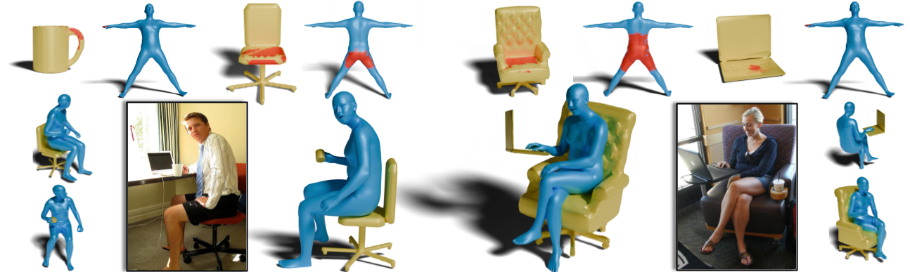
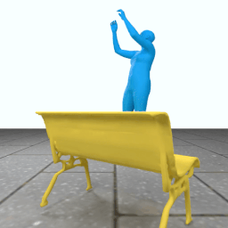
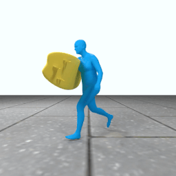
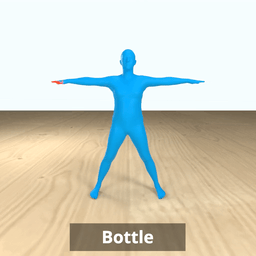

<h1 align="center">InteractVLM: 3D Interaction Reasoning from 2D Foundational Models</h1>

<p align="center">
  
</p>

<div align="center"> 
    <a href="https://saidwivedi.in/">Sai Kumar Dwivedi</a><sup>1</sup>,
    <a href="https://anticdimi.github.io/">Dimitrije Antić</a><sup>2</sup>,
    <a href="https://sha2nkt.github.io//">Shashank Tripathi</a><sup>1</sup>,
    <a href="https://otaheri.github.io/">Omid Taheri</a><sup>1</sup>,<br/>
    <a href="https://thoth.inrialpes.fr/people/schmid/">Cordelia Schmid</a><sup>3</sup>,
    <a href="https://ps.is.mpg.de/person/black">Michael J. Black</a><sup>1</sup>,
    <a href="https://dtzionas.com/">Dimitrios Tzionas</a><sup>2</sup>
</div>

<br />

<div align="center"> 
<p style="text-align: center;"><span role="presentation" dir="ltr"><sup><small>1</small></sup>Max Planck Institute for Intelligent Systems, Tübingen<br /><sup><small>2</small></sup>University of Amsterdam&nbsp; &nbsp; &nbsp;<sup><small>3</small></sup>Inria, France</span></p>
<p style="text-align: center;"><span role="presentation" dir="ltr"></span></p>
<p></p>
</div>

<h5 align="center">
    <a href="https://interactvlm.is.tue.mpg.de">
        
    </a>
    <a href="https://www.youtube.com/watch?v=brxygxM1nRk">
        
    </a>
    <a href="https://arxiv.org/abs/2504.05303">
        
    </a>
    
</h5><br />

<div style="display:flex;">
    
</div>
<br />
<p style="text-align: justify;">
    <span style="color:#007acc; font-weight:bold;">InteractVLM</span> estimates 3D contact points on both human bodies and objects from single in-the-wild images, enabling accurate human-object joint reconstruction in 3D.
    We introduce a novel task, <span style="color:#cc6600; font-weight:bold; ">Semantic Human Contact</span>, which goes beyond the traditional Binary Human Contact to infer object-specific contacts on bodies. 
    By leveraging the rich visual knowledge of large <span style="color:#cc6600; font-weight:bold;">Vision-Language Models</span>, we address the limited availability of ground-truth 3D interaction data for training, resulting in better generalization to diverse real-world interactions.
</p>

## Code Status

- ▣ 3D Human Contact Prediction - Using [DAMON](https://deco.is.tue.mpg.de) and [LEMON](https://yyvhang.github.io/LEMON/) datasets
   - ▣ Training Code
   - ▣ Evaluation Code
   - ▣ Demo Code
- ▣ 3D Object Affordance Prediction - Using [PIAD](https://yyvhang.github.io/publications/IAG/index.html) dataset
   - ▣ Training Code
   - ▣ Evaluation Code
   - ▣ Demo Code
- ☐ 3D Object Contact Prediction - Using [PICO](https://pico.is.tue.mpg.de) dataset
   - ☐ Training, Evaluation and Demo Code
- ☐ Object Shape Retrieval from Single Image
- ☐ Optimization code for Joint reconstruction

## Installation

### Setup Environment

1. **Install Micromamba** (if not already installed):
   ```bash
   curl -Ls https://micro.mamba.pm/api/download/linux-64/latest | tar -xvj bin/micromamba
   sudo mv bin/micromamba /usr/local/bin/
   ```

2. **Create and activate environment**:
   ```bash
   micromamba create -n interactvlm python=3.10 -c conda-forge
   micromamba activate interactvlm
   ```

3. **Install PyTorch with CUDA 12.1**:
   ```bash
   pip install torch==2.1.0 torchvision==0.16.0 torchaudio==2.1.0 --index-url https://download.pytorch.org/whl/cu121
   ```

4. **Clone the repository**:
   ```bash
   git clone https://github.com/saidwivedi/InteractVLM.git
   cd InteractVLM
   ```

5. **Install dependencies**:
   ```bash
   pip install -r requirements.txt
   pip install flash-attn --no-build-isolation
   DS_BUILD_FUSED_ADAM=1 pip install deepspeed==0.15.1
   ```

## Data and Model Downloads

### Essential Data Files

To run InteractVLM, you need to download essential data files and pre-trained models. We provide a convenient script to handle this process.

### Download Script Usage

1. **Register for access** at [https://interactvlm.is.tue.mpg.de](https://interactvlm.is.tue.mpg.de) to get your credentials

2. **Run the download script**:
   ```bash
   bash fetch_data.sh
   ```

## Code Structure

```
InteractVLM/
├── 📁 model/                         # Core model implementation
│   ├── ..
├── 📁 datasets/                      # Data loading and processing
│   ├── ..
├── 📁 utils/                         # Utility functions
│   ├── ..
├── 📁 preprocess_data/               # Data preprocessing scripts
│   ├── ..
├── 📁 scripts/                       # Execution scripts
│   ├── ..
├── 📁 data/                          # Dataset folders
│   ├── ..
├── 📁 trained_models/                # Trained models
│   ├── ..
├── 📄 train.py                       # Main training script
├── 📄 evaluate.py                    # Main evaluation script
├── 📄 run_demo.py                    # Run Demo
└── 📄 requirements.txt               # Python dependencies
```

## Training and Evaluation

### Environment Setup

Before running training or evaluation scripts, ensure CUDA is properly configured:

```bash
# Set CUDA_HOME environment variable (adjust path based on your CUDA installation)
export CUDA_HOME=/usr/local/cuda  # or your CUDA installation path
export PATH=$CUDA_HOME/bin:$PATH
export LD_LIBRARY_PATH=$CUDA_HOME/lib64:$LD_LIBRARY_PATH
```

### Data Generation

To generate the data needed for training, run the following script. We will provide the processed datasets soon.

```bash
# Generate preprocessed data
bash scripts/run_datagen.sh
```

### Training

```bash
# Run training script with default configuration
bash scripts/run_train.sh
```

### Evaluation

#### **Model Weight Preparation**
If you have trained a new model, prepare the weights for evaluation:

```bash
# Prepare weights for model 0 (adjust number as needed)
bash scripts/run_prepare_weights.sh 0
```

#### **Run Evaluation on Pre-trained Models**
```bash
# Evaluate the model on either DAMON or PIAD. Adjust the congfiguration accordingly
bash scripts/run_eval.sh
```

### Demo

Run the interactive demo on your own images:

```bash
# Run demo script
bash scripts/run_demo.sh
```

## Results

### Joint Human-Object Reconstruction
<p align="center">
  
  
  
  
</p>

### Semantic Human Contact
<p align="center">
  
  
  
</p>


## Acknowledgements

We thank
<a href="https://is.mpg.de/person/acseke">Alpár Cseke</a> 
for his assistance with evaluating joint human-object reconstruction.
We also thank
<a href="https://ps.is.mpg.de/person/talexiadis">Tsvetelina Alexiadis</a> and
<a href="https://ps.is.mpg.de/person/tmcconnell">Taylor Obersat</a>
for MTurk evaluation,
<a href="https://yfeng95.github.io">Yao Feng</a>,
<a href="https://kulits.github.io">Peter Kulits</a>, and
<a href="https://ps.is.mpg.de/person/mdiomataris">Markos Diomataris</a> 
for their valuable feedback and
<a href="https://is.mpg.de/~bpellkofer">Benjamin Pellkofer</a>
for IT support.
SKD is supported by the International Max Planck Research School for Intelligent Systems (IMPRS-IS). 
The UvA part of the team is supported by an ERC Starting Grant (STRIPES, 101165317, PI: D. Tzionas).

## Citation
If you find this code useful for your research, please consider citing the following paper:

```bibtex
@inproceedings{dwivedi_interactvlm_2025,
    title     = {{InteractVLM}: {3D} Interaction Reasoning from {2D} Foundational Models},
    author    = {Dwivedi, Sai Kumar and Antić, Dimitrije and Tripathi, Shashank and Taheri, Omid and Schmid, Cordelia and Black, Michael J. and Tzionas, Dimitrios},
    booktitle = {Proceedings of the IEEE/CVF Conference on Computer Vision and Pattern Recognition (CVPR)},
    month     = {June},
    year      = {2025},
}
```
## License

This code is available for **non-commercial scientific research purposes** as defined in the [LICENSE file](LICENSE). By downloading and using this code you agree to the terms in the [LICENSE](LICENSE). Third-party datasets and software are subject to their respective licenses.

## Contact

For code related questions, please contact sai.dwivedi@tuebingen.mpg.de

For commercial licensing (and all related questions for business applications), please contact ps-licensing@tue.mpg.de.

